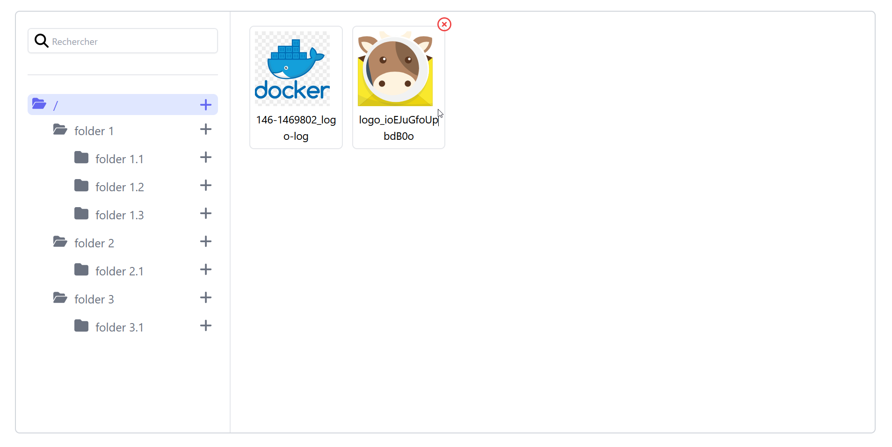

# Filemanager - vue3

Here is a filemanager to manage the images of his site. It allows you to avoid uploading the same image several times.

[](https://github.com/TheoMeunier/vue-filemanager/blob/master/filemanager.png)

## Installation

```bash
npm install isox-filemanager
```

or

```bash
yarn add isox-filemanager
```

## Usage

```js
import { FileManager } from 'isox-filemanager'

app.use(FileManager)
```

```vue
<filemanager endpoint="https://your_api.com"/>
```


## API

I have created the filemanager, so you have to create the API that goes with it. As you go along in the api folder you
could find different api files for the tools / technology.

## Route API

| URL           | METHODE | Description   |
|---------------|---------|---------------|
| /folders      | GET     | Get Folders   |
| /folders      | POST    | Create Folder |
| /folders/{id} | DELETE  | Delete Folder |
| /files        | GET     | Get File      |
| /files        | POST    | Create File   |
| /files/{id}   | DELETE  | Delete File   |